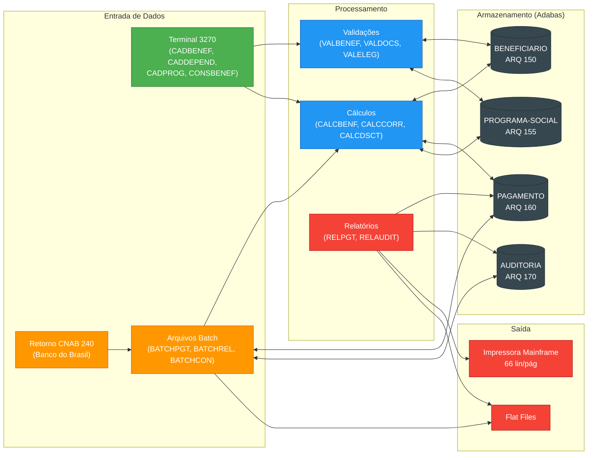

<!-- markdownlint-disable MD013 MD025 MD026 MD028 MD029 MD034 MD040 MD051 MD060 -->

# Mapa de Dependências — SIFAP Legado

  

> 🗺 **Você está aqui:** [Kit PT-BR](../README.md) → [Estágio 1](README.md) → **dependency-map**

> **Para quem é isto?** Este é um **artefato preenchido pelo time** durante o Estágio 1 (Arqueologia).
>
> **O que você terá ao final do estágio:**
>
> 1. Este documento totalmente preenchido com os dados reais do legado SIFAP
> 2. Rastreabilidade para `01-arqueologia/legado-sifap/` (programas `.NSN` e DDMs)
> 3. Base de evidência usada nas EARS do Estágio 2 (`source_legacy:`)
>
> 📘 **Guia passo a passo:** [`GUIDE.md`](GUIDE.md).

> Use diagramas Mermaid para mapear as dependências entre programas Natural e DDMs Adabas.
> O objetivo é visualizar "quem chama quem" e "quem lê/escreve o quê".

## Como descobrir dependências

- Use `grep` ou Copilot Chat para listar todas as ocorrências de `CALLNAT` nos 15 arquivos `.NSN`.
- Prompt útil: _"Liste todas as ocorrências de CALLNAT nestes arquivos e desenhe um diagrama Mermaid."_
- Para leitura/escrita em DDMs: procure por `READ`, `READ LOGICAL`, `STORE`, `UPDATE`, `DELETE`.

## Diagrama de Dependências entre Programas

> Substitua o exemplo abaixo pelo mapa real do seu time. **Meta:** cobrir todos os 15 programas, sem órfãos.

```mermaid
flowchart TD
 classDef online fill:#4CAF50,stroke:#2E7D32,color:#fff
 classDef calc fill:#2196F3,stroke:#1565C0,color:#fff
 classDef valid fill:#9C27B0,stroke:#6A1B9A,color:#fff
 classDef batch fill:#FF9800,stroke:#E65100,color:#fff
 classDef relat fill:#F44336,stroke:#B71C1C,color:#fff
 classDef ddm fill:#37474F,stroke:#263238,color:#fff

 subgraph "Cadastro (Online)"
  CADBENEF["CADBENEF.NSN<br/>Cadastro de Beneficiários"]:::online
  CADDEPEND["CADDEPEND.NSN<br/>Cadastro de Dependentes"]:::online
  CADPROG["CADPROG.NSN<br/>Cadastro de Programas Sociais"]:::online
  CONSBENEF["CONSBENEF.NSN<br/>Consulta de Beneficiários"]:::online
 end

 subgraph "Cálculos (Online)"
  CALCBENF["CALCBENF.NSN<br/>Cálculo de Benefícios"]:::calc
  CALCCORR["CALCCORR.NSN<br/>Correção Monetária"]:::calc
  CALCDSCT["CALCDSCT.NSN<br/>Cálculo de Descontos"]:::calc
 end

 subgraph "Validações (Online)"
  VALBENEF["VALBENEF.NSN<br/>Validação de Beneficiário"]:::valid
  VALDOCS["VALDOCS.NSN<br/>Validação de Documentos"]:::valid
  VALELEG["VALELEG.NSN<br/>Validação de Elegibilidade"]:::valid
 end

 subgraph "Batch (Scheduler)"
  BATCHPGT["BATCHPGT.NSN<br/>Geração de Pagamentos"]:::batch
  BATCHREL["BATCHREL.NSN<br/>Relatório Consolidado"]:::batch
  BATCHCON["BATCHCON.NSN<br/>Conciliação Bancária"]:::batch
 end

 subgraph "Relatórios"
  RELPGT["RELPGT.NSN<br/>Relatório de Pagamentos"]:::relat
  RELAUDIT["RELAUDIT.NSN<br/>Relatório de Auditoria"]:::relat
 end

 subgraph "DDMs Adabas"
  DDM_BENEF[("BENEFICIARIO<br/>ARQ 150")]:::ddm
  DDM_PGTO[("PAGAMENTO<br/>ARQ 160")]:::ddm
  DDM_PROG[("PROGRAMA-SOCIAL<br/>ARQ 155")]:::ddm
  DDM_AUDIT[("AUDITORIA<br/>ARQ 170")]:::ddm
 end

 CADBENEF -->|READ/STORE/UPDATE| DDM_BENEF
 CADDEPEND -->|READ/UPDATE| DDM_BENEF
 CADPROG -->|READ/STORE| DDM_PROG
 CONSBENEF -->|READ| DDM_BENEF
 CONSBENEF -->|READ| DDM_PGTO

 CALCBENF -->|READ| DDM_BENEF
 CALCBENF -->|READ| DDM_PROG
 CALCBENF -->|STORE| DDM_PGTO
 CALCCORR -->|READ/UPDATE| DDM_PGTO
 CALCDSCT -->|READ| DDM_PGTO
 CALCDSCT -->|READ| DDM_BENEF
 CALCDSCT -->|UPDATE| DDM_PGTO

 VALBENEF -->|READ| DDM_BENEF
 VALDOCS -->|READ| DDM_BENEF
 VALELEG -->|READ| DDM_BENEF
 VALELEG -->|READ| DDM_PROG

 BATCHPGT -->|READ| DDM_BENEF
 BATCHPGT -->|READ/STORE| DDM_PGTO
 BATCHPGT -->|READ| DDM_PROG
 BATCHREL -->|READ| DDM_PGTO
 BATCHREL -->|READ| DDM_BENEF
 BATCHCON -->|READ/UPDATE| DDM_PGTO
 BATCHCON -->|READ/STORE| DDM_AUDIT

 RELPGT -->|READ| DDM_PGTO
 RELPGT -->|READ| DDM_BENEF
 RELAUDIT -->|READ| DDM_AUDIT
```

> **Legenda de cores:** 🟢 Online (Cadastro) · 🔵 Cálculos · 🟣 Validações · 🟠 Batch · 🔴 Relatórios · ⬛ DDMs Adabas
>
> **Nota:** Não há chamadas `CALLNAT` entre programas. Todos os 15 programas são pontos de entrada independentes que usam apenas `PERFORM` para sub-rotinas internas.

> **Nota:** Não há chamadas `CALLNAT` entre programas. Todos os 15 programas são pontos de entrada independentes que usam apenas `PERFORM` para sub-rotinas internas.

## Diagrama de Fluxo de Dados (DDMs)

## Tabela de Dependências

| Programa       | PERFORM (sub-rotinas internas)                             | Lê (FIND/READ) DDMs                          | Escreve (STORE/UPDATE) DDMs         | Observações                                                        |
| -------------- | ---------------------------------------------------------- | --------------------------------------------- | ----------------------------------- | ------------------------------------------------------------------ |
| CADBENEF.NSN   | VALIDA-CPF                                                 | BENEFICIARIO                                  | BENEFICIARIO (STORE, UPDATE)        | Inclusão/alteração; valida CPF Mod-11; status auto ≥75 anos        |
| CADDEPEND.NSN  | —                                                          | BENEFICIARIO                                  | BENEFICIARIO (UPDATE)               | Vincula até 5 dependentes no grupo PE; valida parentesco           |
| CADPROG.NSN    | CONSULTA-PROG                                              | PROGRAMA-SOCIAL                               | PROGRAMA-SOCIAL (STORE)             | Mantém tabela de programas sociais; inclusão e consulta            |
| CONSBENEF.NSN  | MASCARA-CPF                                                | BENEFICIARIO, PAGAMENTO                       | —                                   | Tela online 3270; busca por CPF ou NIS; exibe histórico de pagtos  |
| CALCBENF.NSN   | DET-FAIXA-RENDA, CALC-DESCONTOS                           | BENEFICIARIO, PROGRAMA-SOCIAL                 | PAGAMENTO (STORE)                   | Calcula valor bruto do benefício com faixas de renda e fator reg.  |
| CALCCORR.NSN   | CALC-INDICE-ACUM                                           | PAGAMENTO                                     | PAGAMENTO (UPDATE)                  | Correção retroativa pela variação do IPCA                          |
| CALCDSCT.NSN   | CALC-CONTRIB-SOCIAL                                        | PAGAMENTO, BENEFICIARIO                       | PAGAMENTO (UPDATE)                  | Descontos compulsórios e judiciais com alíquotas parametrizadas    |
| VALBENEF.NSN   | VALIDA-CPF-COMPLETO, VALIDA-DATA, VALIDA-NOME              | BENEFICIARIO                                  | —                                   | Rotina chamada antes de qualquer gravação no ARQ 150               |
| VALDOCS.NSN    | VALIDA-CPF-DOC, VALIDA-RG, CHECK-DOC-ESPECIAL              | BENEFICIARIO                                  | —                                   | Valida CPF, RG e documentos complementares                        |
| VALELEG.NSN    | VERIF-ELEG-ESPECIFICA                                      | BENEFICIARIO, PROGRAMA-SOCIAL                 | —                                   | Verifica elegibilidade (faixa etária, renda, região 99)           |
| BATCHPGT.NSN   | DET-FAIXA-RENDA-BATCH                                      | BENEFICIARIO, PAGAMENTO, PROGRAMA-SOCIAL      | PAGAMENTO (STORE)                   | Gera ciclo mensal de pagamentos; 13º/abono; auditoria             |
| BATCHREL.NSN   | IMPRIME-CABECALHO                                          | PAGAMENTO, BENEFICIARIO                       | —                                   | Relatório consolidado mensal por região/programa/status; flat file |
| BATCHCON.NSN   | GRAVA-AUDITORIA-DIVERG, GRAVA-AUDITORIA-CONC               | PAGAMENTO, AUDITORIA                          | PAGAMENTO (UPDATE), AUDITORIA (STORE) | Concilia CNAB 240 (Banco do Brasil); grava divergências           |
| RELPGT.NSN     | IMPRIME-SUBTOTAL, IMPRIME-CABECALHO                        | PAGAMENTO, BENEFICIARIO                       | —                                   | Relatório analítico de pagamentos; 66 lin/pág; subtotais por prog |
| RELAUDIT.NSN   | IMPRIME-CAB-AUDIT                                          | AUDITORIA                                     | —                                   | Trilha de auditoria com filtros por período e tipo de ação         |

## Dependências Circulares

> Liste aqui qualquer dependência circular encontrada (programa A chama B que chama A):

- **Nenhuma dependência circular encontrada.** Todos os 15 programas usam apenas `PERFORM` (sub-rotinas internas definidas no mesmo arquivo). Não há `CALLNAT` (chamada entre programas) em nenhum dos 15 arquivos.

## Programas Órfãos

> Programas que não são chamados por nenhum outro (possíveis pontos de entrada ou código morto):

- **Todos os 15 programas são pontos de entrada independentes** — nenhum é chamado via `CALLNAT` por outro programa do conjunto. Cada um é invocado diretamente pelo operador (online) ou pelo scheduler batch (JCL).
- Não há código morto identificado: todos os programas acessam pelo menos um DDM e implementam lógica de negócio ativa.

## Resumo de Acesso aos DDMs

| DDM                | Leitores (FIND/READ)                                                                                      | Escritores (STORE/UPDATE)                        |
| ------------------ | --------------------------------------------------------------------------------------------------------- | ------------------------------------------------ |
| **BENEFICIARIO**   | CADBENEF, CADDEPEND, CONSBENEF, CALCBENF, CALCDSCT, VALBENEF, VALDOCS, VALELEG, BATCHPGT, BATCHREL, RELPGT | CADBENEF (STORE/UPDATE), CADDEPEND (UPDATE)      |
| **PAGAMENTO**      | CONSBENEF, CALCBENF, CALCCORR, CALCDSCT, BATCHPGT, BATCHREL, BATCHCON, RELPGT                             | CALCBENF (STORE), CALCCORR (UPDATE), CALCDSCT (UPDATE), BATCHPGT (STORE), BATCHCON (UPDATE) |
| **PROGRAMA-SOCIAL** | CADPROG, CALCBENF, VALELEG, BATCHPGT                                                                     | CADPROG (STORE)                                  |
| **AUDITORIA**      | BATCHCON, RELAUDIT                                                                                         | BATCHCON (STORE)                                 |

---

### Continuar a leitura

<table width="100%">
<tr>
<td width="50%" valign="top" align="left">
<strong>← ANTERIOR</strong> 
<a href="business-rules-catalog.md"><strong>business-rules-catalog.md</strong></a> 
Catálogo de regras.
</td>
<td width="50%" valign="top" align="right">
<strong>PRÓXIMO →</strong> 
<a href="discovery-report.md"><strong>discovery-report.md</strong></a> 
Síntese final.
</td>
</tr>
</table>

↑ <a href="README.md">Voltar ao Kit PT-BR</a>

