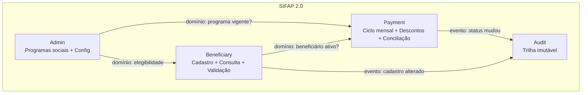
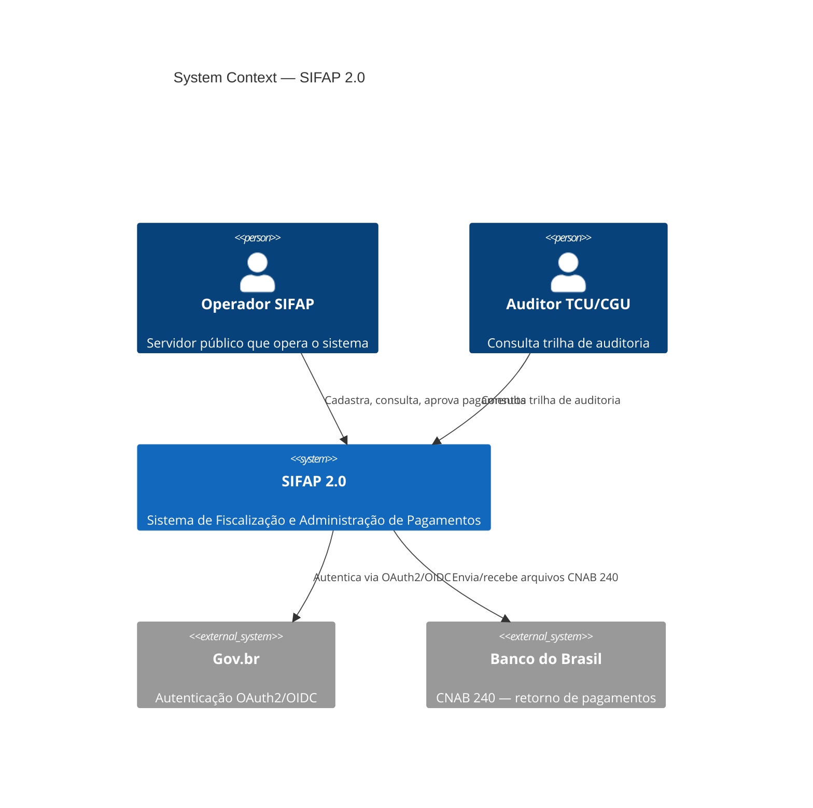
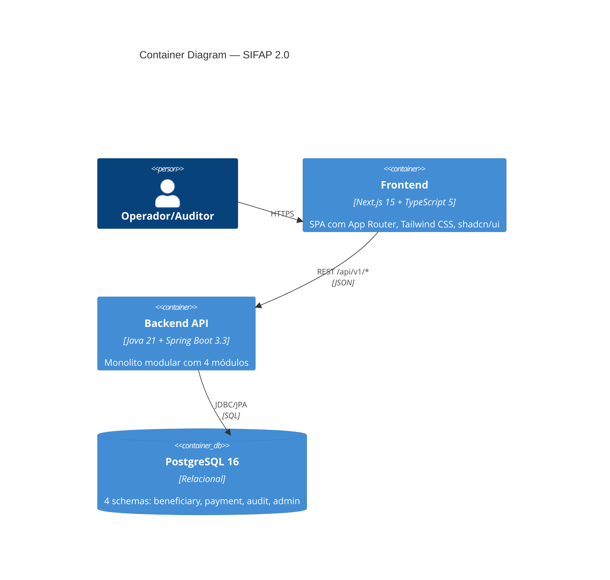
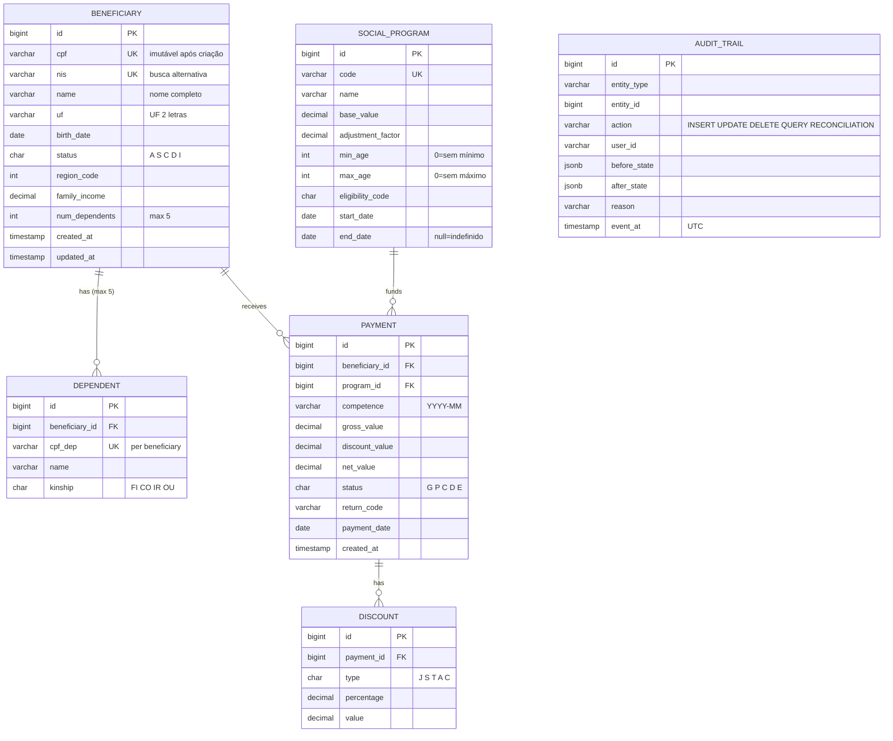

<!-- markdownlint-disable MD013 MD025 MD026 MD028 MD029 MD034 MD040 MD051 MD060 -->

# SPECIFICATION — SIFAP 2.0 · Spec Completa

  

> 🗺 **Você está aqui:** [Kit PT-BR](../README.md) → [Estágio 2](README.md) → **SPECIFICATION**

## Metadados

- **Versão da spec:** 0.1.0 (Estágio 2 — fim)
- **Time:** Time Azul 2
- **Aprovado pelo Product Owner:** ☐ (pendente — Passagem H2)
- **Origem dos requisitos:** `01-arqueologia/business-rules-catalog.md` (BR-001 a BR-045)

---

## 1. Escopo

O SIFAP 2.0 moderniza o sistema legado Natural/Adabas de 29 anos para Java 21 + Spring Boot 3.3, cobrindo 4 bounded contexts:

- **`beneficiary`** — Cadastro, consulta e validação de beneficiários e dependentes
- **`payment`** — Ciclo mensal de pagamentos, descontos, cálculos e conciliação bancária
- **`audit`** — Trilha de auditoria imutável para todas as operações
- **`admin`** — Gestão de programas sociais e configuração do sistema

**Fora de escopo:** integração SIAFI, relatórios analíticos avançados, módulo de BI.

---

## 2. Diagramas de Arquitetura

### 2.1 Bounded Contexts



### 2.2 C4 — Nível 1 (System Context)



### 2.3 C4 — Nível 2 (Container)



### 2.4 Modelo de Dados (ER)



---

## 3. Requisitos (EARS)

### Módulo Beneficiary

#### REQ-BEN-001 · Cadastro de beneficiário com validação de CPF

```yaml
REQ-BEN-001:
  pattern: ubiquitous
  text: "O SIFAP deve validar o CPF do beneficiário usando o algoritmo
         Módulo 11 antes de permitir a inclusão no cadastro."
  source_legacy: 01-arqueologia/legado-sifap/natural-programs/CADBENEF.NSN#L225-L260
  business_rule: BR-034, BR-001
  acceptance:
    - "CPF válido (ex.: 529.982.247-25) → cadastro aceito."
    - "CPF inválido (dígito verificador errado) → HTTP 422 com mensagem."
    - "CPF duplicado → HTTP 409 Conflict."
    - "CPF é imutável após criação — tentativa de alteração retorna HTTP 422."
  priority: P0
  risk: CRÍTICO
```

#### REQ-BEN-002 · Status automático SÊNIOR para maiores de 75 anos

```yaml
REQ-BEN-002:
  pattern: event-driven
  text: "Quando a idade de um beneficiário ultrapassar 75 anos (calculada
         na data de processamento), o SIFAP deve alterar automaticamente
         o status para 'S' (Sênior)."
  source_legacy: 01-arqueologia/legado-sifap/natural-programs/CADBENEF.NSN#L135-L137
  business_rule: BR-002
  acceptance:
    - "Beneficiário com 74 anos, 364 dias → status permanece 'A'."
    - "Beneficiário completa 75 anos → status muda para 'S' no próximo processamento."
    - "Evento de auditoria gerado com motivo 'AUTO_SENIOR'."
  priority: P1
  risk: ALTO
```

#### REQ-BEN-003 · Limite de 5 dependentes por beneficiário

```yaml
REQ-BEN-003:
  pattern: unwanted
  text: "O SIFAP não deve permitir o cadastro de mais de 5 dependentes
         por beneficiário."
  source_legacy: 01-arqueologia/legado-sifap/natural-programs/CADDEPEND.NSN#L58-L60
  business_rule: BR-006, BR-007, BR-008, BR-009
  acceptance:
    - "Beneficiário com 4 dependentes → adição do 5º aceita."
    - "Beneficiário com 5 dependentes → tentativa de adicionar 6º retorna HTTP 422."
    - "Beneficiário com status 'C' ou 'D' → adição de dependente retorna HTTP 422."
    - "Parentesco restrito a: FI (filho), CO (cônjuge), IR (irmão), OU (outro)."
    - "CPF duplicado entre dependentes do mesmo beneficiário → HTTP 409."
  priority: P1
  risk: MÉDIO
```

#### REQ-BEN-004 · Consulta de beneficiário por CPF ou NIS

```yaml
REQ-BEN-004:
  pattern: optional
  text: "Onde o operador informar um CPF ou NIS, o SIFAP deve retornar
         os dados cadastrais do beneficiário correspondente, incluindo
         dependentes e programa vinculado."
  source_legacy: 01-arqueologia/legado-sifap/natural-programs/CONSBENF.NSN#L65-L79
  business_rule: BR-042
  acceptance:
    - "Busca por CPF válido existente → retorna dados completos."
    - "Busca por NIS existente → retorna mesmos dados."
    - "CPF/NIS inexistente → HTTP 404."
    - "CPF mascarado em logs de acesso (LGPD)."
  priority: P0
  risk: MÉDIO
```

#### REQ-BEN-005 · Validação de elegibilidade por programa

```yaml
REQ-BEN-005:
  pattern: complex
  text: "Enquanto o status do beneficiário for 'A' (ativo),
         quando a elegibilidade for consultada,
         se a idade estiver dentro da faixa do programa (IDADE-MIN a IDADE-MAX)
         E a região NÃO for 99 (diplomático — sempre elegível),
         o SIFAP deve retornar o resultado da validação de elegibilidade."
  source_legacy: 01-arqueologia/legado-sifap/natural-programs/VALELEG.NSN#L71-L108
  business_rule: BR-039, BR-040, BR-041
  acceptance:
    - "Beneficiário ativo, idade dentro da faixa → elegível."
    - "Beneficiário ativo, idade fora da faixa → não elegível."
    - "Beneficiário com região 99 → sempre elegível (bypass)."
    - "Beneficiário com status 'S','C','D','I' → não elegível."
    - "IDADE-MAX=0 → sem limite superior de idade."
  priority: P0
  risk: ALTO
```

---

### Módulo Payment

#### REQ-PAY-001 · Teto de descontos não judiciais em 30%

```yaml
REQ-PAY-001:
  pattern: unwanted
  text: "O SIFAP não deve permitir que o total de descontos NÃO judiciais
         exceda 30% do valor bruto do pagamento."
  source_legacy: 01-arqueologia/legado-sifap/natural-programs/CALCDSCT.NSN#L101-L103
  business_rule: BR-030
  acceptance:
    - "Pagamento bruto R$ 1000 e desconto 'TAX' de R$ 400 → desconto truncado em R$ 300 (30%)."
    - "Desconto judicial de 80% do bruto → aceito integralmente."
    - "Desconto sindical fixo 1% → aplicado antes do cálculo do teto."
  priority: P0
  risk: CRÍTICO
```

#### REQ-PAY-002 · Desconto judicial sem teto

```yaml
REQ-PAY-002:
  pattern: event-driven
  text: "Quando um desconto do tipo 'J' (judicial) é aplicado a um pagamento,
         o SIFAP deve adicionar o valor integralmente ao total de descontos,
         sem aplicar o teto de 30%."
  source_legacy: 01-arqueologia/legado-sifap/natural-programs/CALCDSCT.NSN#L125-L131
  business_rule: BR-031
  acceptance:
    - "Desconto judicial de 80% do bruto → aceito integralmente."
    - "Múltiplos descontos judiciais somam sem limite."
    - "Desconto judicial pode ser valor fixo OU percentual."
  priority: P0
  risk: CRÍTICO
```

#### REQ-PAY-003 · Geração de ciclo mensal de pagamentos

```yaml
REQ-PAY-003:
  pattern: event-driven
  text: "Quando o ciclo de pagamento mensal é iniciado, o SIFAP deve criar
         um registro de Payment para cada beneficiário com status 'A' (ativo),
         aplicando: fator regional (BR-017), fator de renda (BR-018),
         fator familiar (BR-027) e fator K do programa (BR-012)."
  source_legacy: 01-arqueologia/legado-sifap/natural-programs/BATCHPGT.NSN#L88-L167
  business_rule: BR-016, BR-017, BR-018, BR-020, BR-027, BR-012
  acceptance:
    - "100 beneficiários ativos → 100 pagamentos gerados com status 'G'."
    - "Beneficiário com status 'S','C','D','I' → nenhum pagamento gerado."
    - "CPF duplicado → apenas primeira ocorrência processada (BR-019)."
    - "Valor bruto = VLR-BASE × fator_regional × fator_renda × fator_familiar × fator_K."
  priority: P0
  risk: CRÍTICO
```

#### REQ-PAY-004 · Contribuição social com faixas

```yaml
REQ-PAY-004:
  pattern: ubiquitous
  text: "O SIFAP deve calcular a contribuição social usando as faixas:
         até R$ 500 = 3%, até R$ 1000 = 5%, até R$ 2000 = 7%, acima = 9%."
  source_legacy: 01-arqueologia/legado-sifap/natural-programs/CALCDSCT.NSN#L61-L68
  business_rule: BR-033
  acceptance:
    - "Bruto R$ 400 → contribuição 3% = R$ 12,00."
    - "Bruto R$ 800 → contribuição 5% = R$ 40,00."
    - "Bruto R$ 3000 → contribuição 9% = R$ 270,00."
  priority: P1
  risk: MÉDIO
```

#### REQ-PAY-005 · Conciliação bancária CNAB 240

```yaml
REQ-PAY-005:
  pattern: event-driven
  text: "Quando o arquivo de retorno CNAB 240 do Banco do Brasil é importado,
         o SIFAP deve atualizar o status de cada pagamento conforme o código
         de retorno: '00'=Pago, '01'=Devolvido, '02'=Estornado."
  source_legacy: 01-arqueologia/legado-sifap/natural-programs/BATCHCON.NSN#L76-L141
  business_rule: BR-024, BR-025, BR-026
  acceptance:
    - "Código retorno '00' → status muda para 'P' (pago)."
    - "Código retorno '01' → status muda para 'D' (devolvido)."
    - "Divergência de valor > R$ 0,01 → gera auditoria de divergência."
    - "Código desconhecido → status permanece 'G', gera alerta."
  priority: P0
  risk: CRÍTICO
```

#### REQ-PAY-006 · Exportação de relatório de pagamentos

```yaml
REQ-PAY-006:
  pattern: optional
  text: "Onde o usuário escolher exportar o relatório de pagamentos do mês,
         o SIFAP deve gerar arquivo CSV com codificação UTF-8 contendo
         todas as colunas exibidas na tela, com quebra por programa social."
  source_legacy: 01-arqueologia/legado-sifap/natural-programs/RELPGT.NSN#L71-L85
  business_rule: BR-043
  acceptance:
    - "CSV gerado com header + linhas, separado por programa."
    - "Arquivo abre corretamente no Excel BR (UTF-8 com BOM)."
    - "Subtotais por programa social incluídos."
  priority: P1
  risk: MÉDIO
```

#### REQ-PAY-007 · Status inicial de pagamento GERADO

```yaml
REQ-PAY-007:
  pattern: ubiquitous
  text: "O SIFAP deve criar todo novo Payment com status 'G' (gerado)."
  source_legacy: 01-arqueologia/legado-sifap/natural-programs/BATCHPGT.NSN#L156
  business_rule: BR-021
  acceptance:
    - "Pagamento recém-criado tem status='G'."
    - "Não há outro caminho de criação além de status='G'."
    - "Transições válidas: G→P, G→C, G→D, G→E."
  priority: P0
  risk: ALTO
```

#### REQ-PAY-008 · Cancelamento manual de pagamento gerado

```yaml
REQ-PAY-008:
  pattern: state-driven
  text: "Enquanto o status de um Payment for 'G' (gerado), o SIFAP deve
         permitir o cancelamento manual pelo operador, registrando o motivo
         informado e alterando o status para 'C' (cancelado)."
  source_legacy: 01-arqueologia/legado-sifap/natural-programs/BATCHPGT.NSN#L160-L167
  business_rule: BR-021
  acceptance:
    - "Pagamento com status 'G' → cancelamento aceito, status muda para 'C'."
    - "Pagamento com status 'P','D','E' → cancelamento rejeitado HTTP 422."
    - "Motivo é obrigatório — envio sem motivo retorna HTTP 422."
    - "Evento de auditoria gerado com ação='UPDATE' e motivo informado."
  priority: P1
  risk: ALTO
```

---

### Módulo Audit

#### REQ-AUD-001 · Trilha de auditoria imutável

```yaml
REQ-AUD-001:
  pattern: ubiquitous
  text: "O SIFAP deve gravar um registro de auditoria para toda operação
         de INSERT, UPDATE ou DELETE em qualquer entidade de domínio,
         contendo: entidade, ID, ação, usuário, estado anterior,
         estado posterior, motivo (se informado) e timestamp UTC."
  source_legacy: 01-arqueologia/legado-sifap/natural-programs/RELAUDIT.NSN#L45-L65
  business_rule: BR-044
  acceptance:
    - "INSERT de beneficiário → 1 registro de auditoria com before=null."
    - "UPDATE de status → registro com before e after preenchidos."
    - "Registros de auditoria não podem ser deletados (DELETE retorna HTTP 405)."
    - "Ações mapeadas: INSERT, UPDATE, DELETE, QUERY, RECONCILIATION, DIVERGENCE."
  priority: P0
  risk: CRÍTICO
```

#### REQ-AUD-002 · Consulta de auditoria por período

```yaml
REQ-AUD-002:
  pattern: optional
  text: "Onde o auditor informar um período de datas, o SIFAP deve retornar
         todos os registros de auditoria dentro do intervalo, com paginação."
  source_legacy: 01-arqueologia/legado-sifap/natural-programs/RELAUDIT.NSN#L77-L82
  business_rule: BR-045
  acceptance:
    - "Consulta sem data início → assume 1997-01-01 (fundação do SIFAP)."
    - "Consulta sem data fim → assume data atual."
    - "Paginação padrão: 20 registros por página."
    - "Filtro por entidade e ação disponível."
  priority: P1
  risk: MÉDIO
```

#### REQ-AUD-003 · Auditoria de transição de status de pagamento

```yaml
REQ-AUD-003:
  pattern: event-driven
  text: "Quando o status de um Payment é alterado, o SIFAP deve gravar
         um registro de auditoria contendo: estado anterior, estado novo,
         usuário que alterou, timestamp UTC e motivo (se informado)."
  source_legacy: 01-arqueologia/legado-sifap/natural-programs/RELAUDIT.NSN#L45-L72
  business_rule: BR-044, BR-025
  acceptance:
    - "Mudar G→P grava 1 registro de auditoria."
    - "Registro contém todos os 5 campos obrigatórios."
    - "Conciliação bancária gera auditoria com ação='RECONCILIATION'."
  priority: P0
  risk: CRÍTICO
```

---

### Módulo Admin

#### REQ-ADM-001 · Cadastro de programa social

```yaml
REQ-ADM-001:
  pattern: ubiquitous
  text: "O SIFAP deve permitir o cadastro de programas sociais com:
         código, nome, valor base, fator de reajuste, faixa etária
         (idade mínima e máxima), código de elegibilidade e vigência."
  source_legacy: 01-arqueologia/legado-sifap/natural-programs/CADPROG.NSN#L60-L82
  business_rule: BR-012, BR-014, BR-015
  acceptance:
    - "Programa com DT-FIM=null → vigência indefinida."
    - "Fator de reajuste aplica fórmula: VLR-CALC = VLR-BASE × (1.00 + FATOR × 0.347215)."
    - "IDADE-MAX=0 → sem limite superior de idade."
    - "Código do programa é imutável após criação (BR-004)."
  priority: P1
  risk: ALTO
```

#### REQ-ADM-002 · Mascaramento de CPF em logs (LGPD)

```yaml
REQ-ADM-002:
  pattern: ubiquitous
  text: "O SIFAP deve mascarar CPF em todos os logs no formato
         XXX.XXX.NNN-NN (mantendo apenas os 3 dígitos centrais e
         os dígitos verificadores)."
  source_legacy: "[GREENFIELD] LGPD Art. 6º (princípio da minimização) — não há equivalente no legado."
  business_rule: "—"
  acceptance:
    - "Log de DEBUG não imprime CPF cru."
    - "Endpoint /actuator/logfile não vaza CPF."
    - "Relatórios exportados mascaram CPF para perfis não autorizados."
  priority: P0
  risk: CRÍTICO
  notes: "Requisito GREENFIELD. Justificativa LGPD documentada."
```

---

## 4. Contratos de API

| Endpoint | Método | Descrição | REQ-ID | Status Code |
|---|---|---|---|---|
| `/api/v1/beneficiaries` | `POST` | Cadastrar beneficiário | REQ-BEN-001 | 201, 409, 422 |
| `/api/v1/beneficiaries/{id}` | `GET` | Consultar beneficiário | REQ-BEN-004 | 200, 404 |
| `/api/v1/beneficiaries/{id}/dependents` | `POST` | Adicionar dependente | REQ-BEN-003 | 201, 409, 422 |
| `/api/v1/beneficiaries/{id}/eligibility` | `GET` | Validar elegibilidade | REQ-BEN-005 | 200, 404 |
| `/api/v1/payments/cycle` | `POST` | Gerar ciclo mensal | REQ-PAY-003 | 201, 409 |
| `/api/v1/payments/reconciliation` | `POST` | Importar CNAB 240 | REQ-PAY-005 | 200, 422 |
| `/api/v1/payments/export` | `GET` | Exportar relatório CSV | REQ-PAY-006 | 200 |
| `/api/v1/payments/{id}/cancel` | `PATCH` | Cancelar pagamento gerado | REQ-PAY-008 | 200, 422 |
| `/api/v1/audit` | `GET` | Consultar auditoria | REQ-AUD-002 | 200 |
| `/api/v1/programs` | `POST` | Cadastrar programa | REQ-ADM-001 | 201, 409 |

---

## 5. Atributos de Qualidade (NFRs)

| Atributo | Meta | Como medir |
|---|---|---|
| Latência p95 | < 200ms para queries de listagem | Testes de performance no Estágio 4 |
| Latência batch | Ciclo mensal < 5min para 10k beneficiários | Testcontainers + medição de tempo |
| Cobertura de testes | ≥ 70% de linhas nos módulos de negócio | JaCoCo no CI |
| Disponibilidade | 99.5% em horário comercial | Azure Monitor |
| Segurança | OWASP Top 10 compliance | Dependabot + CodeQL |
| LGPD | CPF mascarado em 100% dos logs | Grep automatizado no CI |

---

## 6. Rastreabilidade BR → REQ-ID

| BR (legado) | REQ-ID (moderno) | Status |
|---|---|---|
| BR-001, BR-034 | REQ-BEN-001 | ✅ coberta |
| BR-002 | REQ-BEN-002 | ✅ coberta |
| BR-006, BR-007, BR-008, BR-009 | REQ-BEN-003 | ✅ coberta |
| BR-042 | REQ-BEN-004 | ✅ coberta |
| BR-039, BR-040, BR-041 | REQ-BEN-005 | ✅ coberta |
| BR-030 | REQ-PAY-001 | ✅ coberta |
| BR-031 | REQ-PAY-002 | ✅ coberta |
| BR-012, BR-016, BR-017, BR-018, BR-019, BR-020, BR-027 | REQ-PAY-003 | ✅ coberta |
| BR-033 | REQ-PAY-004 | ✅ coberta |
| BR-024, BR-025, BR-026 | REQ-PAY-005 | ✅ coberta |
| BR-043 | REQ-PAY-006 | ✅ coberta |
| BR-021 | REQ-PAY-007, REQ-PAY-008 | ✅ coberta |
| BR-044 | REQ-AUD-001 | ✅ coberta |
| BR-045 | REQ-AUD-002 | ✅ coberta |
| BR-044, BR-025 | REQ-AUD-003 | ✅ coberta |
| BR-012, BR-014, BR-015 | REQ-ADM-001 | ✅ coberta |
| — (GREENFIELD) | REQ-ADM-002 | ✅ LGPD |
| BR-028, BR-029 | — | ⏸ correção monetária fora de escopo v1 |
| BR-032 | — | ⏸ desconto sindical simplificado (evoluir em v2) |

> ✅ **18 REQ-IDs têm `source_legacy:`** (17 apontam para `.NSN`, 1 GREENFIELD justificado).

---

## 7. Referências

- [Business Rules Catalog](../01-arqueologia/business-rules-catalog.md)
- [Discovery Report](../01-arqueologia/discovery-report.md)
- [Dependency Map](../01-arqueologia/dependency-map.md)
- [ADR-001 — Monolito Modular](ADR-001.md)
- [ADR-002 — Mapeamento Adabas→PostgreSQL](ADR-002.md)
- [ADR-003 — Autenticação OAuth2/JWT](ADR-003.md)
- [Scope Decisions](scope-decisions.md)
